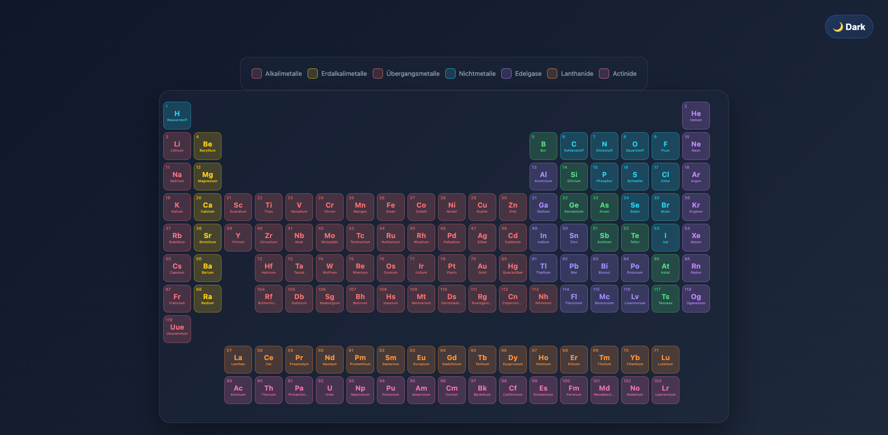
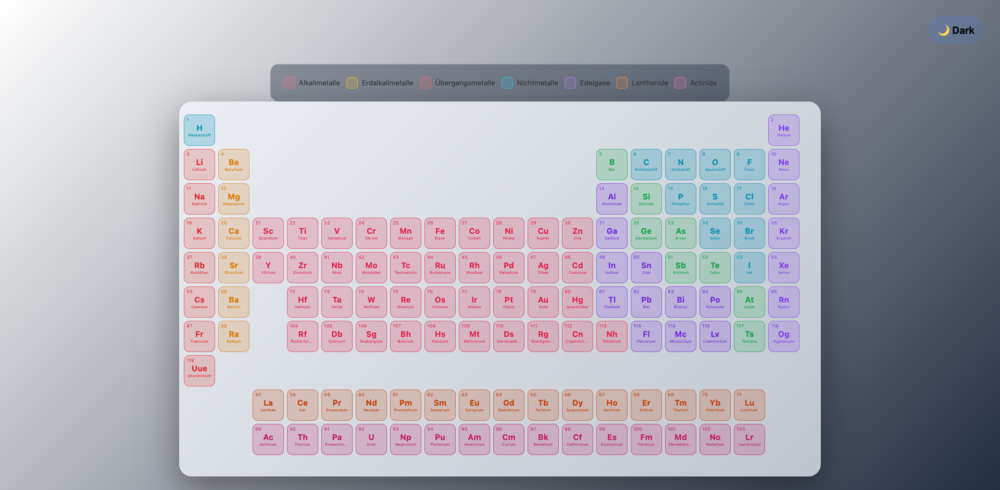

# 🧪 Modernes Periodensystem - Interactive Periodic Table

Ein interaktives, hochoptimiertes Periodensystem mit Dark/Light Theme, kompaktem 4-spaltigem Info-Panel und Wikipedia-Integration.

## 🚀 [Live Demo](https://helmutqualtinger.github.io/PeriodicTable/)

**[➡️ Klick hier zur Live-Demo öffnen](https://helmutqualtinger.github.io/PeriodicTable/)**

## ✨ Features

### 🎨 Design & Styling
- **Dark/Light Theme** - Umschalten zwischen Dunkelmodus (Standard) und Hellmodus mit hohem Kontrast
- **Modernes UI** - Glasmorphismus-Effekte, sanfte Übergänge und optimierte Hover-Effekte
- **Kompakte Elemente** - 60×60px Kacheln für optimale Übersicht
- **Farbcodierung** - 11 Elementkategorien mit visuellen Unterscheidungen:
  - Alkalimetalle, Erdalkalimetalle, Übergangsmetalle
  - Nichtmetalle, Edelgase, Halogene
  - Halbmetalle, Lanthanide, Actinide
  - Post-Übergansmetalle, Unbekannte Elemente

### ⚛️ Animiertes 3D Bohr-Atommodell
Beim Hovern über ein Element erscheint ein animiertes Bohr-Modell im Info-Panel:
- **Kern** - Protonen (rot) und Neutronen (weiß) als rotierende 3D-Kugel mit Fibonacci-Verteilung
- **Elektronenschalen** - Blaue Elektronen kreisen auf 3D-inklinatierten Bahnen mit verschiedenen Neigungswinkeln
- **Tiefeneffekt** - Z-Sorting, tiefenbasierte Größe und Helligkeit für räumliche Darstellung
- **Skalierung** - Kerngröße und Nukleonenpunkte passen sich automatisch an (H = 1 Proton, Og = 294 Nukleonen)

### 📊 Ultra-Kompaktes Info-Panel
Beim Hovern über ein Element erscheint ein 4-spaltiges Info-Panel zwischen Beryllium und Bor:
- **Symbol & Name** - Elementsymbol mit deutschem Namen
- **8 Informationsfelder in kompaktem 4×2 Layout:**
  - Aggregatzustand, Dichte, Schmelzpunkt, Siedepunkt
  - Protonen/Neutronen, Kategorie, Atomgewicht, Elektronenkonfiguration
- **Smart Hover Logic** - Panel bleibt sichtbar beim Übergang vom Element zum Panel
- **Position** - Im leeren Bereich zwischen Be (Spalte 2) und B (Spalte 13)

### 🔗 Wikipedia Integration
- **📖 Wikipedia-Link** - Klick auf jedes Element öffnet die deutsche Wikipedia-Seite
- **Direkt im Element** - Wikipedia-Icon erscheint beim Hovern auf Element
- **Neue Registerkarte** - Wikipedia öffnet in neuem Tab, Periodensystem bleibt erhalten

### 🌍 Deutsche Sprache
- Alle Elementnamen auf Deutsch
- Deutsche Labels im Info-Panel
- Deutsche Kategorienamen in der Legende

### 📱 Legend
Visual legend mit Farbcodes für alle Elementkategorien - hilft beim schnellen Verständnis der Elementtypen

## 📸 Screenshots

### Dark Mode

### Light Mode

## 🎯 Verwendung

### Theme wechseln
- Klick auf den Button oben rechts (🌙 Dark / ☀️ Light)
- Die Einstellung wird im Browser gespeichert

### Element-Informationen anzeigen
1. Fahre mit der Maus über ein Element
2. Info-Panel erscheint mit animiertem 3D Bohr-Modell und allen Details
3. Bleibe über dem Panel, um es zu lesen

### Zu Wikipedia gehen
1. Fahre über ein Element (📖 Icon erscheint)
2. Klick auf das Element
3. Wikipedia-Seite öffnet sich in neuem Tab

## 🛠️ Technologie-Stack

- **HTML5** - Semantische Struktur
- **CSS3** - Modern Layout (Grid, Flexbox), Glasmorphismus, Gradients
- **Canvas API** - Animiertes 3D Bohr-Atommodell mit requestAnimationFrame
- **JavaScript (Vanilla)** - Keine Dependencies erforderlich
- **API-Integration** - [Periodic-Table-JSON](https://github.com/Bowserinator/Periodic-Table-JSON)

## 💾 Daten

Das Projekt lädt alle 118 Elemente live von einer externen JSON-API:
- Elementsymbole, Namen, Nummern
- Atomare Massen
- Dichte, Schmelz-/Siedepunkte
- Elektronenkonfiguration
- Kategorie-Informationen

## 🎨 Themes

### Dark Theme (Standard)
- Dunkler Hintergrund (#0f172a)
- Helle Schrift
- Kühle Farbtöne

### Light Theme
- Weißer Hintergrund
- Dunkle Schrift
- Hoher Kontrast
- Intensivere Element-Farben

## 📦 Browser-Kompatibilität

- Chrome/Edge (empfohlen)
- Firefox
- Safari
- Erfordert modernes JavaScript (ES6+)

## 🚀 Performance

- Lädt alle 118 Elemente dynamisch
- Optimiert für schnelle Hover-Reaktionen
- Smooth 60fps Canvas-Animation (Bohr-Modell)
- Animation stoppt automatisch beim Verlassen des Panels (kein idle GPU-Verbrauch)
- LocalStorage für Theme-Persistenz

## 📄 Lizenz

Open Source - Frei verwendbar

## 🔗 Quellen

- Element-Daten: [Periodic-Table-JSON](https://github.com/Bowserinator/Periodic-Table-JSON)
- Wikipedia Integration: Deutsche Wikipedia
- Design Inspiration: Moderne Wissenschafts-Apps

---

**Erstellt mit ❤️ für Chemie-Enthusiasten & Studenten**
